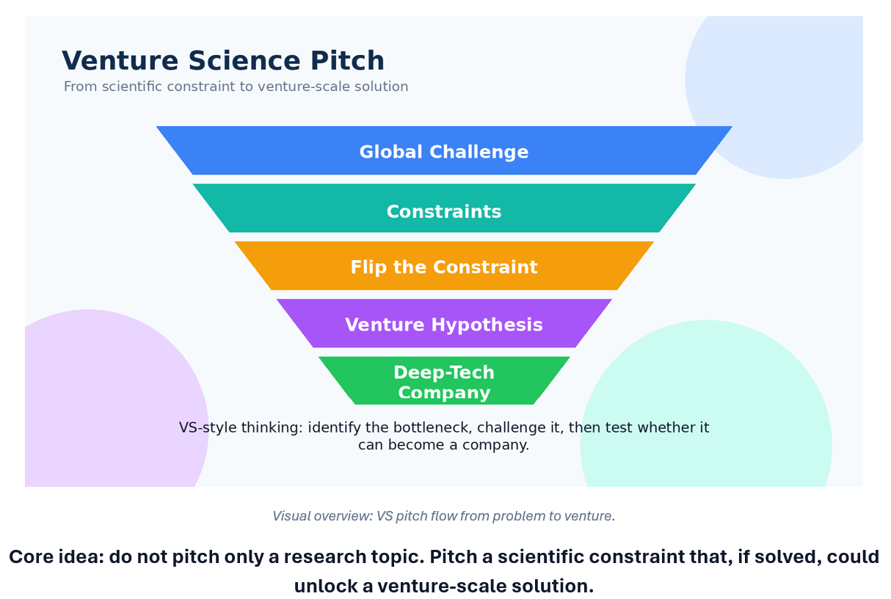
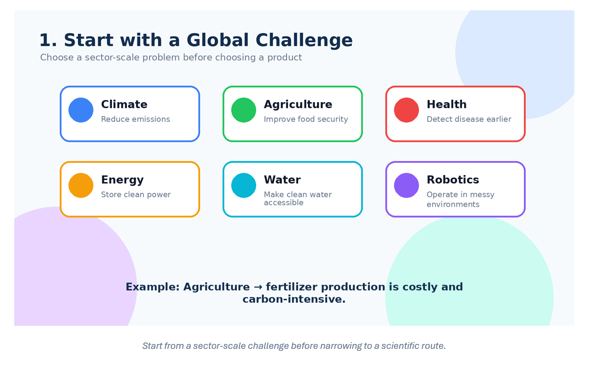
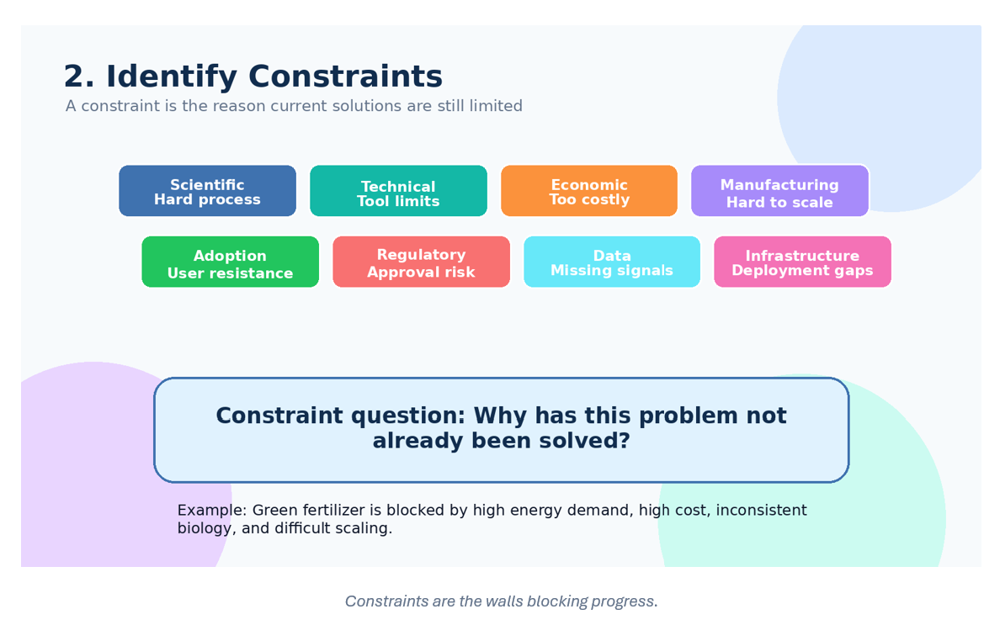
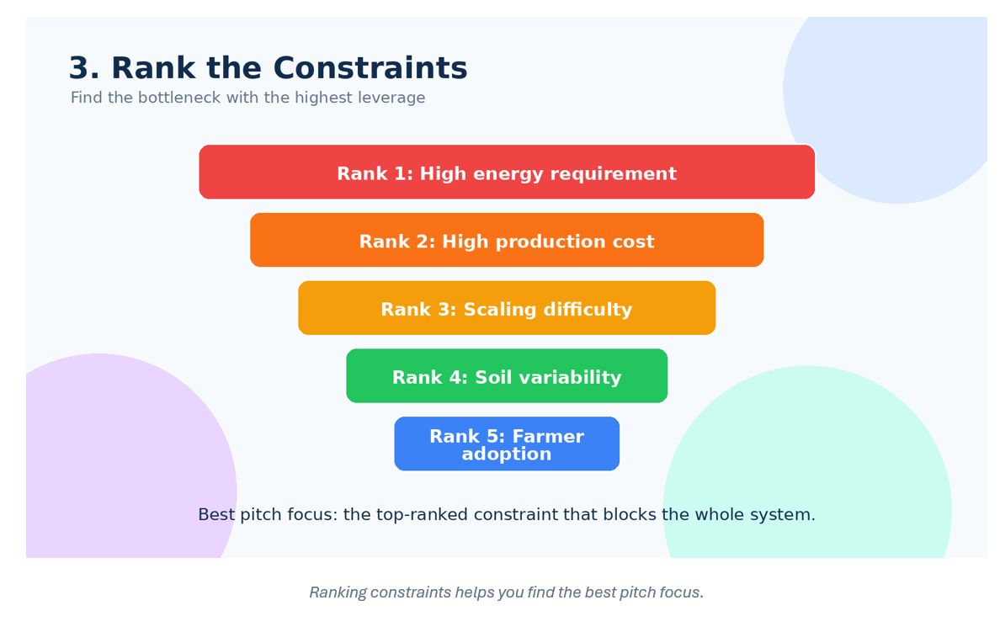
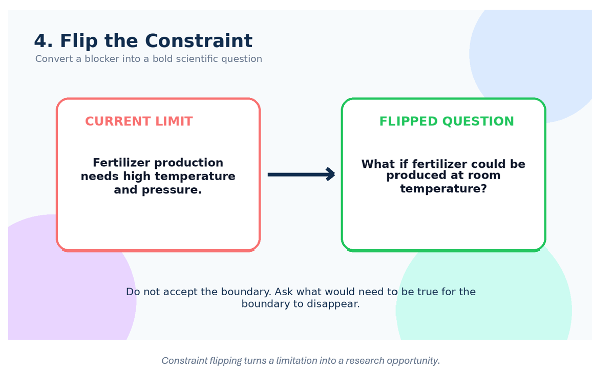
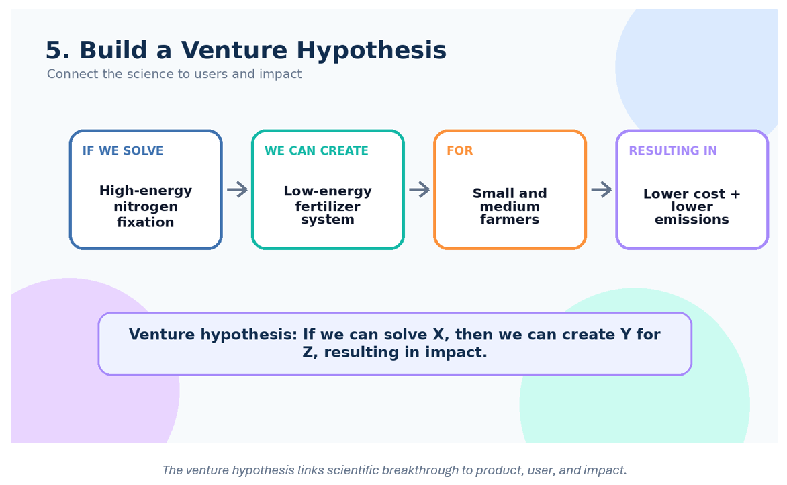
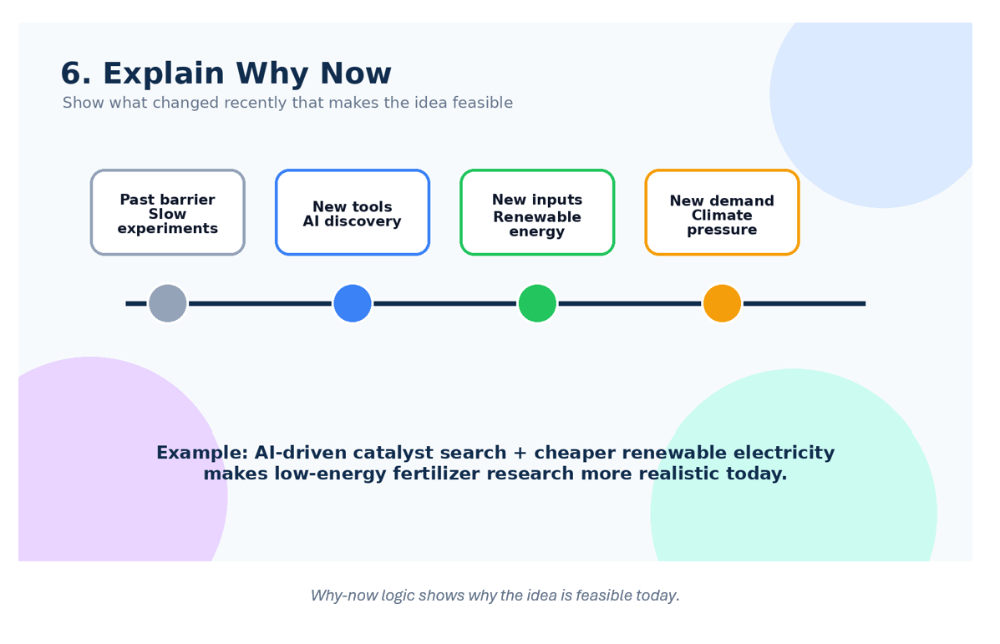
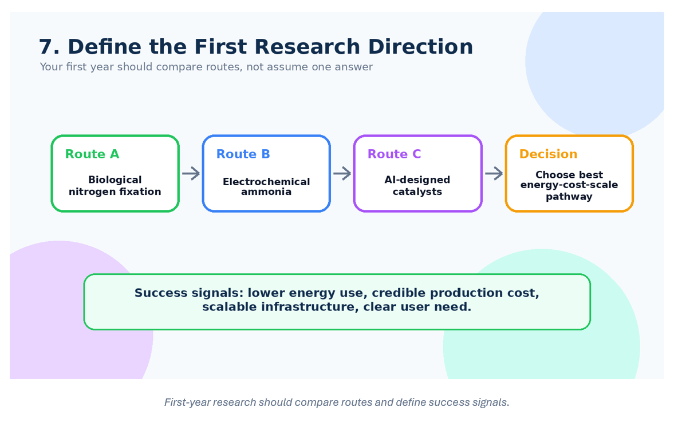
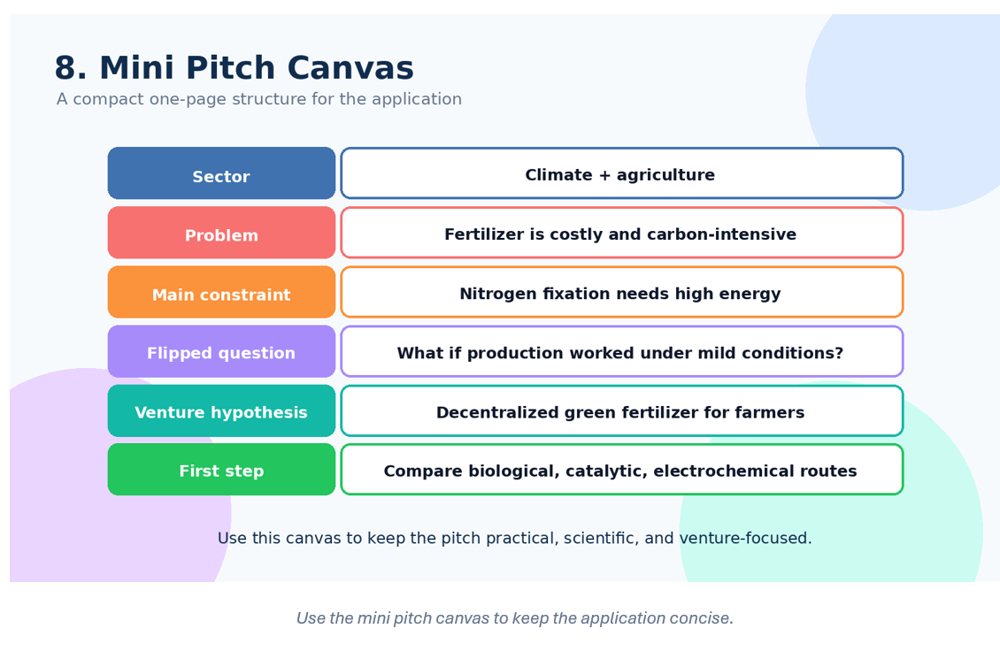
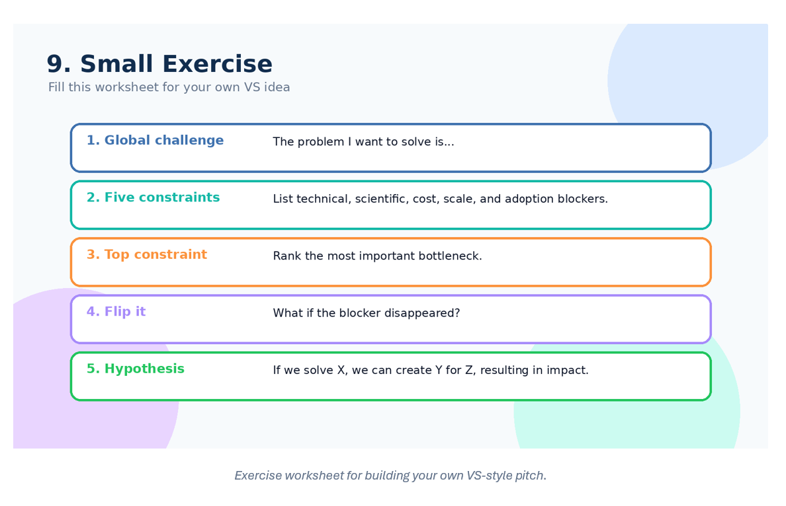

# Venture Science Pitch Tutorial

## Turning a Scientific Problem into a Deep-Tech Venture


---
## At-a-Glance Tutorial Structure

| Step | Topic | Purpose |
|---:|---|---|
| 1 | Global Challenge | Choose a sector-scale problem, not just a product idea. |
| 2 | Constraints | Identify the scientific, technical, economic, and adoption blockers. |
| 3 | Ranking | Find the highest-leverage bottleneck. |
| 4 | Flip | Turn the bottleneck into a bold scientific question. |
| 5 | Venture Hypothesis | Connect science to users, product, and impact. |
| 6 | Why Now | Show why the opportunity is newly possible. |
| 7 | Research Direction | Define the first investigation and success signals. |
| 8 | Mini Pitch | Compress the idea into a clear pitch canvas. |
| 9 | Exercise | Practice with your own sector and challenge. |

## 0. What is the VS Pitch?

The Venture Science pitch is different from a normal PhD proposal.
Instead of only asking:

> “What do I want to research?”

You ask:

> “What scientific constraint is blocking a major global solution, and can solving it create a new venture?”

### Short Example

| Traditional PhD Thinking             | VS Thinking                                                                                                                    |
| ------------------------------------ | ------------------------------------------------------------------------------------------------------------------------------- |
| I want to study battery materials.   | Energy storage is limited by battery cost, density, and lifetime. Which constraint can be flipped to create a scalable venture? |
| I want to research AI in healthcare. | Diagnosis is slow and expensive. Can AI reduce clinical bottlenecks in a way that becomes a company?                            |

---

## 1. Start with a Global Challenge

Choose a large problem that affects society, industry, or the planet.


### Example Sectors

| Sector      | Global Challenge   | Example Problem                              |
| ----------- | ------------------ | -------------------------------------------- |
| Climate     | Carbon emissions   | Cement production emits too much CO₂         |
| Agriculture | Food security      | Fertilizer is costly and carbon-intensive    |
| Health      | Disease detection  | Early diagnosis is expensive and slow        |
| Energy      | Storage            | Batteries degrade quickly                    |
| Water       | Clean water access | Filtration is expensive in rural areas       |
| Robotics    | Automation         | Robots struggle in unstructured environments |

### Short Example

**Sector:** Agriculture
**Challenge:** Fertilizer production creates high carbon emissions.
**Problem statement:**
Farmers need affordable fertilizers, but current production methods are energy-intensive and environmentally damaging.

---

## 2. Identify the Constraints

A constraint is a barrier that prevents the current system from improving.

Ask:

> Why has this problem not already been solved?


### Constraint Types

| Constraint Type | Meaning                                 | Example                              |
| --------------- | --------------------------------------- | ------------------------------------ |
| Scientific      | Nature of the process is hard to change | Nitrogen fixation needs high energy  |
| Technical       | Current technology is limited           | Sensors are not accurate enough      |
| Economic        | Too costly to scale                     | Green hydrogen is expensive          |
| Manufacturing   | Difficult to produce at scale           | New materials are hard to fabricate  |
| Adoption        | Users may not accept it                 | Farmers may avoid unfamiliar tools   |
| Regulatory      | Approval is slow or complex             | Medical AI needs clinical validation |

### Short Example

**Problem:** Green fertilizer is too expensive.

Possible constraints:

1. Ammonia production requires high temperature and pressure.
2. Renewable production is still expensive.
3. Biological alternatives are inconsistent.
4. Farmers need very low-cost input.
5. Large-scale infrastructure is difficult to build.

---

## 3. Rank the Constraints

After listing constraints, rank them by importance.

The strongest constraint is usually the best place to build your pitch.

### Ranking Table Example

| Rank | Constraint              | Why It Matters                                               |
| ---- | ----------------------- | ------------------------------------------------------------ |
| 1    | High energy requirement | Main reason fertilizer production is expensive and polluting |
| 2    | High production cost    | Limits adoption by farmers                                   |
| 3    | Scaling difficulty      | Prevents mass deployment                                     |
| 4    | Soil variability        | Reduces reliability                                          |
| 5    | Farmer adoption         | Affects market entry                                         |


### Short Example

The most important constraint is:

> Current nitrogen fertilizer production requires very high energy.

This becomes the focus of the pitch.

---

## 4. Flip the Constraint

This is the core of the VS approach.

Instead of accepting the limitation, challenge it.

### Constraint-Flipping Formula

| Current Constraint                | Flipped Question                                          |
| --------------------------------- | --------------------------------------------------------- |
| Batteries degrade quickly         | What if batteries could self-heal?                        |
| Fertilizer needs high energy      | What if fertilizer could be produced at room temperature? |
| Cancer diagnosis is slow          | What if early signals could be detected before symptoms?  |
| Robots fail in messy environments | What if robots could learn like humans from few examples? |


### Short Example

**Original constraint:**
Ammonia production requires high temperature and high pressure.

**Flipped constraint:**
What if nitrogen fertilizer could be produced under mild conditions using microbes, catalysts, or renewable electricity?

---

## 5. Build a Venture Hypothesis

A venture hypothesis connects the scientific idea to a possible company.

### Formula

> If we can solve **[scientific constraint]**, then we can create **[technology/product]** for **[users]**, resulting in **[large impact]**.

### Example Table

| Part                  | Example                                 |
| --------------------- | --------------------------------------- |
| Scientific constraint | High-energy nitrogen fixation           |
| Technology            | Low-energy fertilizer production system |
| User                  | Small and medium farmers                |
| Impact                | Lower cost and reduced carbon emissions |



### Short Example

> If we can develop a low-energy nitrogen fixation process, then we can create affordable green fertilizer systems for farmers, reducing both input costs and carbon emissions.

---

## 6. Explain Why Now

A good pitch must show why this idea is possible today.

Ask:

> What has changed recently in science, technology, tools, or market demand?



### Why-Now Table

| New Development           | Why It Helps                              |
| ------------------------- | ----------------------------------------- |
| AI for material discovery | Speeds up catalyst search                 |
| Synthetic biology         | Enables new biological production systems |
| Renewable electricity     | Makes green processes more viable         |
| Better sensors            | Enables real-time monitoring              |
| Climate policy pressure   | Creates demand for low-carbon solutions   |

### Short Example

Ten years ago, testing new catalysts was slow and expensive.
Today, AI-driven discovery and cheaper renewable electricity make low-energy fertilizer pathways more realistic.

---

## 7. Define the First Research Direction

You do not need to solve everything immediately.
You need a clear first investigation.


### Research Direction Table

| Research Question                         | Method                                                    | Success Signal                  |
| ----------------------------------------- | --------------------------------------------------------- | ------------------------------- |
| Which pathway can reduce energy use most? | Compare biological, catalytic, and electrochemical routes | Lowest energy requirement       |
| Can it scale?                             | Study production cost and infrastructure                  | Cost below current alternatives |
| Will farmers adopt it?                    | Interview users and test use cases                        | Clear willingness to pay        |

### Short Example



The first year could compare three routes:

1. Biological nitrogen fixation
2. Electrochemical ammonia production
3. AI-designed catalysts

The goal is to find the route with the best combination of scientific feasibility, cost, and scalability.

---

## 8. Create a Mini Pitch

Use this compact format for your VS PITCH

### Mini Pitch Template

| Section            | Content                                                     |
| ------------------ | ----------------------------------------------------------- |
| Sector             | Climate and agriculture                                     |
| Problem            | Fertilizer production is carbon-intensive                   |
| Main constraint    | Nitrogen fixation requires high energy                      |
| Flipped constraint | What if fertilizer could be produced under mild conditions? |
| Venture hypothesis | Low-energy fertilizer systems for farmers                   |
| Impact             | Lower emissions, cheaper fertilizer, improved food security |
| First step         | Compare biological, catalytic, and electrochemical routes   |


### Short Example Pitch

**Sector:** Climate and agriculture

**Problem:** Fertilizer production is expensive and carbon-intensive.

**Main constraint:** Current nitrogen fertilizer production depends on energy-intensive ammonia synthesis.

**Flipped constraint:** What if nitrogen fertilizer could be produced locally under mild conditions using biological or catalytic systems?

**Venture hypothesis:** If we can develop a low-energy nitrogen fixation system, we can create decentralized green fertilizer production for farmers, reducing cost and emissions.

**First research step:** Compare biological, electrochemical, and catalyst-based pathways for energy efficiency, cost, and scalability.

---

## 9. Visual Pitch Flow


```text
Global Challenge
       ↓
Problem Statement
       ↓
List Constraints
       ↓
Rank Constraints
       ↓
Flip the Biggest Constraint
       ↓
Create Venture Hypothesis
       ↓
Explain Why Now
       ↓
Define First Research Direction
       ↓
Deep-Tech Venture Pitch
```


---

# Small Exercise

## Exercise Topic: Choose Your Own Sector

Choose one sector:

| Option | Sector         |
| ------ | -------------- |
| A      | Climate        |
| B      | Agriculture    |
| C      | Healthcare     |
| D      | Robotics       |
| E      | Energy         |
| F      | AI for Science |
| G      | Water          |

---

## Step 1: Write the Global Challenge

> The problem I want to solve is:
>
> ---

### Example

> The problem I want to solve is the high carbon footprint of fertilizer production.

---

## Step 2: List Five Constraints

| Rank Later | Constraint                         |
| ---------- | ---------------------------------- |
|            | __________________________________ |
|            | __________________________________ |
|            | __________________________________ |
|            | __________________________________ |
|            | __________________________________ |

### Example

| Constraint                              |
| --------------------------------------- |
| Fertilizer production needs high energy |
| Green alternatives are expensive        |
| Biological options are inconsistent     |
| Farmers need low-cost solutions         |
| Scaling production is difficult         |

---

## Step 3: Rank the Top Three Constraints

| Rank | Constraint                         |
| ---- | ---------------------------------- |
| 1    | __________________________________ |
| 2    | __________________________________ |
| 3    | __________________________________ |

### Example

| Rank | Constraint              |
| ---- | ----------------------- |
| 1    | High energy requirement |
| 2    | High production cost    |
| 3    | Scaling difficulty      |

---

## Step 4: Flip the Biggest Constraint

**Original constraint:**

> ---

**Flipped question:**

> What if ___________________________________?

### Example

**Original constraint:**

> Fertilizer production requires high temperature and pressure.

**Flipped question:**

> What if fertilizer could be produced at room temperature using microbes or catalysts?

---

## Step 5: Write Your Venture Hypothesis

Use this format:

> If we can solve ________________________, then we can create ________________________ for ________________________, resulting in ________________________.

### Example

> If we can solve the high-energy nitrogen fixation problem, then we can create low-cost green fertilizer systems for farmers, resulting in cheaper food production and lower carbon emissions.

---

# Final Checklist for a Strong VS Pitch

| Question                                                       | Yes/No |
| -------------------------------------------------------------- | ------ |
| Have I chosen a global-scale problem?                          |        |
| Have I identified real constraints?                            |        |
| Have I ranked the most important constraint?                   |        |
| Have I flipped the constraint into a bold scientific question? |        |
| Have I connected the science to a possible venture?            |        |
| Have I explained why this is possible now?                     |        |
| Have I described the first research direction?                 |        |

---

# One-Line Summary

A strong pitch says:

> “Here is a major global problem. Here are the constraints blocking progress. Here is the scientific constraint I want to challenge. If solved, this could become a scalable deep-tech venture.”
